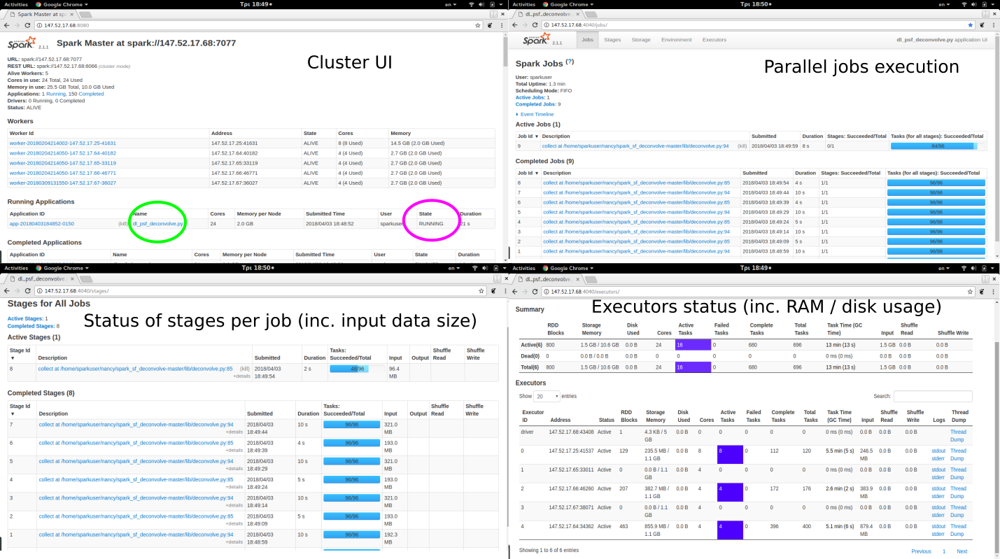

# Distributed Space Variant Deconvolution

## Introduction

This folder implements the Dedale distributed learning architecture for solving the space variant deconvolution of a large-scale stack of galaxy survey images.

The current version of this module is compliant to the original Python library (for standalone execution over a small number of stacked images) which is available [here](https://github.com/sfarrens/sf_deconvolve). 

## Prerequisities and dependencies

* A Spark-complian cluster, according to the guidelines available [here](../README.md)

* For running the space variant deconvolution modules over the cluster, each of the cluster nodes (master and slaves) should have installed:
	- [Numpy](http://www.numpy.org/). Tested with vestion 1.13.3
	- [Scipy](http://www.scipy.org/). Tested with vestion 1.0.0
	- [Astropy](http://www.astropy.org/). Tested with version 2.0.2 
	- [Future](https://pypi.python.org/pypi/future). Tested with version 0.16.0
	- [iSap / Sparse2D library](http://www.cosmostat.org/software/isap) and [cfitsio](https://heasarc.gsfc.nasa.gov/fitsio/fitsio.html) libraries. Tested with iSAP version 3.1. The Sparse2D library should be compiled C++ modules. For a cluster with the 64-bit Ubuntu 16.04 LTS configuration, the precompiled libraries available [here](../docs/useful/) may be used. 
	For configuring the ISAP library on each terminal of the cluster, add the Sparse2D executables to the $PATH system variable. For example if the ISAP library is compiled at `/home/user/isap`, then:
		- Open the .profile file at `/home/user/`. 
		- Define the isap location: `ISAP="$HOME/isap`
		- Append the `$PATH` variable: `PATH="$ISAP/cxx/sparse2d/bin:$PATH"`
		- Save and close the .profile file. Log out and log back in for the change on the `$PATH` to take effect.

## Deployment on cluster

For deploymet over the cluster:

* Download the contents of this subfolder at the master node at a location with read/write/execute permissions. For the purposes of this guide the preselected folder is `/home/user/ds_psf`.

* Compress the `lib` folder,  which contains the deconvolution modules (including both standalone and distributed execution), into `lib.zip` at `/home/user/ds_psf`.

* Compress the `sf_tools` folder, which contains original optimisation and analysis modules (taken from [here](https://github.com/sfarrens/sf_deconvolve)) into `sf_tools.zip` at `/home/user/ds_psf`.


## Execution

The main python script for execution is the `dl_psf_deconvolve.py`, nevertheless all input parameters for execution can be defined at the `runexper.sh`. 

### Main execution script and optimization parameters.

The format of each entry at the `runexper.sh` is the following:

`$SPARK`/bin/spark-submit --master spark://`<IP of master node>`:7077 --py-files lib.zip,sf_tools.zip  dl_psf_deconvolve.py -i `<input stack of noisy data>`.npy -p `<input psf>`.npy --mode `<optimization mode>` --n_iter `<number of optimization iterations>` --pn `<number of blocks per RDD>`  > `<application log file>`.txt

mv log.out `<spark log file>`.out

where:
*  `$SPARK`: the folder of the spark build version at the master node (e.g., `/usr/local/spark`)

* `<IP of master node>`: the IP of the master node

*  `<input stack of noisy data>`.npy is the location and name of the input data in npy format (e.g., `example_image_stack`) available [here](example_data/100x41x41/))

*   `<input psf>`.npy is the is the location and name of the psf in npy format (e.g., `example_psfs` available [here] (example_data/100x41x41/))

*   `<optimization mode>`: The optimisation mode taking one of the values {sparse, lowr}.

*   `<number of optimization iterations>`: The maximum number of optimization iterations

*   `<number of blocks per RDD>`: is the number of data blocks for splitting the input data. In a typical cluster this number should be at least the double of total available CPU cores (for example if the cluster has 24 CPU cores, then `<number of blocks per RDD>` >=48) 

* `<application log file>`.txt: the log file for saving all print-out messages from the execution of the program.

* `<spark log file>`.out: the log file containing the log messages of the Spark master and nodes. 

Note: A complete list of all input parameters for the noisy stack images deconvolution is available [here](https://github.com/sfarrens/sf_deconvolve). Nevertheless, the distributed space variant deconvolution herein provided supports the following configuration:

* Optimization (input argument `--mode`): Low-rank (`lowr`) and sparsity-based (`sparse`)
* Gradient type (input parameter `--grad_type`):  Implementation of deconvolution with PSFs provided (`psf_known`).
* Optimization method (input parameter `--opt_type`): Condat-Vu proximal splitting method (`condat`).
* PSF type (input parameter `--psf_type`) for convolution: Spatially variant (`obj_var`)
* Type of low-rank regularisation (input parameter `--lowr_type`): Standard (`standard`).


### Termination criteria and output
The module terminates when either the maximum number of iterations (`--n_iter`) has been reached or the convergence of the cost function over a sliding window (of length `--cost_window`) is below a predefined threshold (`--tolerance`). 

Upon completion the module stores in a mat file the following information:

* The final value of the primal optimization variable (`primal_var` : np.ndarray)

* The final value of the dual optimization variable (`dual_var` : np.ndarray)

* The values of the cost function calculated within the optimization loop (`cost`: list)

* The execution time per optimization iteration (`time_iters` : list)

* The total execution time for the optimization (`time_totopt` : float)

* The total execution time for the module (`time_tot`: float)

Note: the naming convention of the mat file is as follows:

```bash
results_<optimization mode>_<number of noisy images>_<number of blocks per RDD>_<experiment id>_n<number of optimization iterations>.mat
```

## Execution Examples

Considering the following cluster-specific parameters:

`$SPARK` = `/usr/local/spark`, `<IP of master node>` = `147.52.17.68`, 

the following input stack of noisy images / PSFs:

`<input stack of noisy data>`.npy  = `example_data/100x41x41/example_image_stack`.npy, `<input psf>`.npy  = `example_data/100x41x41/example_psfs`.npy,

and `<number of optimization iterations>` = 100, `<number of blocks per RDD>` = `96`, `<application log file>`.txt = `test`.txt, 
`spark_log_file`.out = `spark_log`.out, the input entry at runexper.sh becomes as follows:

1. For the low-rank based optimization (i.e. `<optimization mode>` = `lowr`):
```bach
/usr/local/spark/bin/spark-submit --master spark://147.52.17.68:7077 --py-files lib.zip,sf_tools.zip  ds_psf_deconvolve.py -i example_data/100x41x41/example_psfs.npy -p example_data/100x41x41/example_psfs.npy --n_iter 100 --mode lowr --pn 96 > test.txt

mv log.out spark_log.out
```

2. For the sparsity-based optimization (i.e. `optimization mode` = `sparse`):
```bach
/usr/local/spark/bin/spark-submit --master spark://147.52.17.68:7077 --py-files lib.zip,sf_tools.zip  ds_psf_deconvolve.py -i example_data/100x41x41/example_psfs.npy -p example_data/100x41x41/example_psfs.npy --n_iter 100 --mode sparse --pn 96 > test.txt

mv log.out spark_log.out
```

Save and execute the runexper.sh file. Open a command terminal and from software module execute runexper.sh, i.e.

```
$ ./runexper.sh
```

The status of execution is indicated at the cluster web-interface:




### Large-scale imaging datasets and results
Considering a stack of 20,000 noisy images the results of distributed sparce variant deconvolution w.r.t. to (a) time of execution, and (b) convergence over time are the following:


## Reference Documents: 

* A. Panousopoulou, S. Farrens, S., Y. Mastorakis, J.L. Starck, P. Tsakalides, "A distributed learning architecture for big imaging problems in astrophysics," In 2017 25th European (pp. 1440-1444). IEEE.

* S.  Farrens,  F.M.  Ngole  Mboula,  and  J.-L.  Starck,  “Space variant deconvolution of galaxy survey images,”  Astronomy and 
& Astrophysics, vol. 601, A66 , 2017.

* "Large Scale Learning Schemes". DEDALE Deliverable D4.2, 2016.
