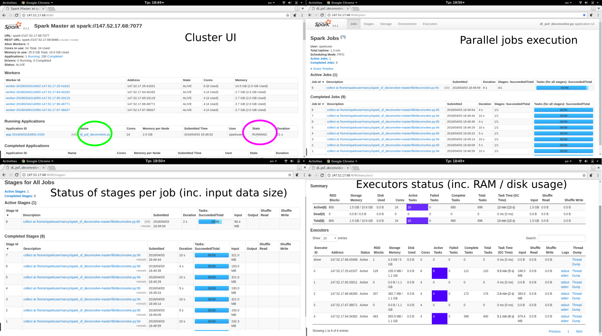
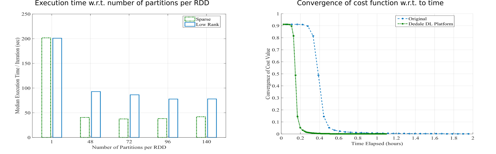

# Distributed Sparse Coupled Dictionary Learning

## Introduction

This folder implements the Dedale distributed learning architecture for solving the solving the problem of super-resolution, adhering to a sparse-based machine learning technique (Sparce Coupled Dictionary Learning) over a large-scale training dataset.

The current version of this module is compliant to the original Python library (for standalone execution over a small number of stacked images) which is available [here](https://github.com/spl-icsforth/SparseCoupledDictionaryLearning). 

## Prerequisities and dependencies

* A Spark-complian cluster, according to the guidelines available [here](../README.md)

* For running the sparce coupled dictionary learning modules over the cluster, each of the cluster nodes (master and slaves) should have installed:
	- [Numpy](http://www.numpy.org/). Tested with vestion 1.13.3
	- [Scipy](http://www.scipy.org/). Tested with vestion 1.0.0
	
## Deployment on cluster

For deploymet over the cluster:

* Download the contents of this subfolder at the master node at a location with read/write/execute permissions. For the purposes of this guide the preselected folder is `/home/user/ds_scdl`.

* Compress `args.py`, `AuxOps.py`, `CDLOps.py` into `lib.zip` at `/home/user/ds_scdl`.


## Execution

The main python script for execution is the `Distributed_SCDL.py`, nevertheless all input parameters for execution can be defined at the `runexper.sh`. 

### Main execution script and optimization parameters.

The format of each entry at the `runexper.sh` is the following:

`$SPARK`/bin/spark-submit --master spark://`<IP of master node>`:7077 --py-files lib.zip  Distributed_SCDL.py --inputhigh `<input samples at high resolution>`.csv --inputlow `<input samples at low resolution>`.csv --dictsize `<dictionary size>` --n_iter `<number of optimization iterations>` --partitions `<number of blocks per RDD>`  --imageN `<number of training samples>`  --bands_h `high resolution dimensions` --bands_l `<low resolution dimensions>` > `<application log file>`.txt

mv log.out `<spark log file>`.out

where:
*  `$SPARK`: the folder of the spark build version at the master node (e.g., `/usr/local/spark`)

*  `<IP of master node>`: the IP of the master node

*  `<input samples at high resolution>`.csv is the location and name of the high resolution training samples (in the form `samples x high resolution dimension`) in csv format (e.g., `Xh_trs`) available [here](example_data/HS/))

*  `<input samples at low resolution>`.csv is the location and name of the low resolution training samples (in the form `samples x low resolution dimension`) in csv format (e.g., `Xl_trs`) available [here](example_data/HS/))

*  `<number of optimization iterations>`: The maximum number of optimization iterations

*  `<dictionary size>`: The size of the low- and high-resolution dictionaries.

*  `<number of blocks per RDD>`: is the number of data blocks for splitting the input data. In a typical cluster this number should be at least the double of total available CPU cores (for example if the cluster has 24 CPU cores, then `<number of blocks per RDD>` >=48) 

*  `<number of training samples>`: the number of training samples

*  `high resolution dimensions`: the dimension at the high resolution

*  `<low resolution dimensions>`: the dimension at the low resolution

*  `<application log file>`.txt: the log file for saving all print-out messages from the execution of the program.

*  `<spark log file>`.out: the log file containing the log messages of the Spark master and nodes. 

Notes: 

1. A complete list of all input parameters for the sparse coupled dictionary training is available [here](https://github.com/spl-icsforth/SparseCoupledDictionaryLearning). The same parameters can also be configured through `runexper.sh` for the herein provided module.

2. The values `<number of training samples>`, `high resolution dimensions`, `<low resolution dimensions>`, should be consistent to the contents of the respective training data provided by csv files. 

### Termination criteria and output

The module terminates when the maximum number of iterations (`--n_iter`) has been reached. 


Upon completion the module stores in a mat file the following information:
        

* The final value of the high-resolution dictionary (`dict_h` : `high resolution dimension x dictionary size`)

* The final value of the low-resolution dictionary (`dict_l` : `low resolution dimension x dictionary size`)

* The values of the normalized root mean square error for the high- and low-resolution calculations (`err_h`, `err_l`: list)

* The execution time per optimization iteration (`time_all` : list)


Note: the naming convention of the mat file is as follows:

```bash
results_fin_<number of training samples>x<dictionary size>_<number of blocks per RDD>_.mat
```


## Execution Examples

Considering the following cluster-specific parameters:

`$SPARK` = `/usr/local/spark`, `<IP of master node>` = `147.52.17.68`, 

the following input training samples at low- /high-resolution:

`<input samples at high resolution>`.csv  = `example_data/HS/Xh_trs`.csv, `<input samples at low resolution>`.csv  = `example_data/HS/Xl_trs`.csv, `<number of training samples>` = `39998`, `high resolution dimensions` = `25`, `<low resolution dimensions>` = 9,

and `<number of optimization iterations>` = 100, `<number of blocks per RDD>` = `96`, `<application log file>`.txt = `test`.txt, 
`spark_log_file`.out = `spark_log`.out, the input entry at runexper.sh for calculating dictionaries of `dictionary size`= `512` atoms, becomes as follows:

```bach
/usr/local/spark/bin/spark-submit --master spark://147.52.17.68:7077 --py-files lib.zip  Distributed_SCDL.py --inputhigh example_data/HS/Xh_trs.csv --inputlow example_data/HS/Xh_trs.csv --dictsize 512 --n_iter 100 --partitions 96 --imageN 39998 --bands_h 25 --bands_l 9  > test.txt

mv log.out spark_log.out
```

Save and execute the runexper.sh file. Open a command terminal and from software module execute runexper.sh, i.e.

```
$ ./runexper.sh
```

The status of execution is indicated at the cluster web-interface:




### Large-scale training datasets and results
Considering a stack of 39998 training samples and dictionaries of 1024 atoms the results of the distributed sparse coupled dictionary training are as follows:




## Reference Documents: 

* "Linear Inverse Problems with Sparsity Constraints," DEDALE DELIVERABLE 3.1, 2016.
* "Large Scale Learning Schemes". DEDALE Deliverable D4.2, 2016.
*  K. Fotiadou, G. Tsagkatakis, P. Tsakalides. Spectral Resolution Enhancement via Coupled Dictionary Learning. Under Review in IEEE Transactions on Remote Sensing.
